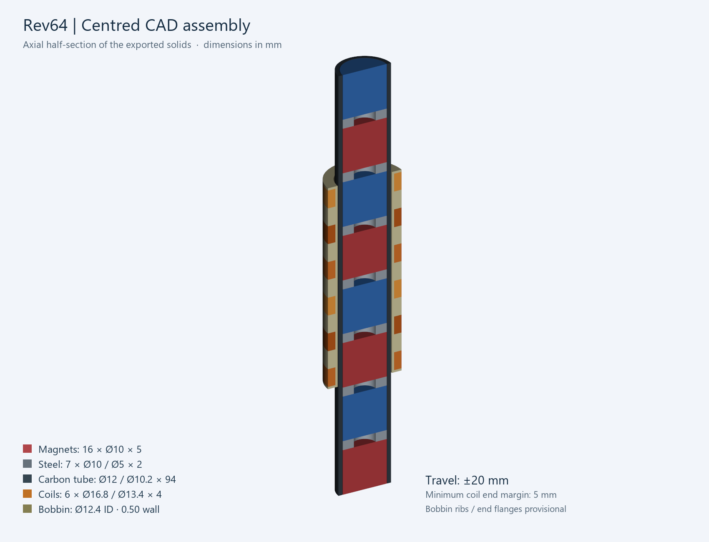
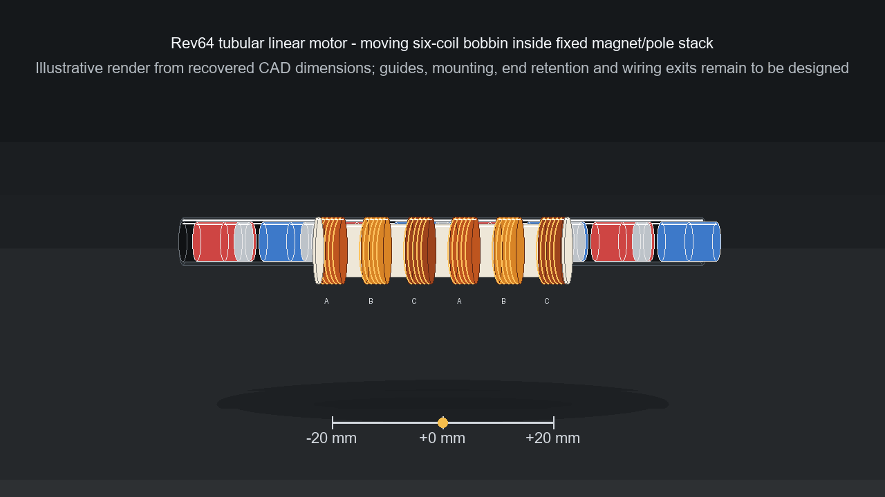

# Tubular linear motor

Revision 64 engineering reference for a three-phase moving-coil tubular permanent-magnet motor. This repository preserves Revision 62 and Revision 64 CAD, electromagnetic models and archived simulation results, with reproducible calculations, a bill of materials and build records.

**Status: prototype definition.** The recovered Rev64 data remains preserved as history. The active build is now a 9-coil, 10 mm N42SH design; see [Current prototype build definition](docs/11-current-build.md) and the [one-rail BOM](docs/12-one-rail-bom.md). It has not been physically qualified. Documentation completeness is not a manufacturing release.



## Motion preview



The animation shows the recovered Rev64 concept with a fixed carbon tube, fixed magnet/pole stack and moving six-coil bobbin over the nominal ±20 mm stroke. It is an illustrative visualization made from the recovered dimensions. It does not add the still-open guide, carriage, end retention, wiring exit or mounting design.

| Nominal feature | Revision 64 |
|---|---|
| Total geometric travel | 40 mm, centred ±20 mm |
| Stationary stack | 94 mm; sixteen Ø10 × 5 mm magnets and seven Ø10 / Ø5 × 2 mm pole rings |
| Carbon tube | Ø12 outside, Ø10.2 inside |
| Moving bobbin | Ø12.4 bore, 0.50 mm base wall, 45 mm overall length |
| Windings | Six coils, 80 turns each, 4 mm wide, 8 mm pitch |
| Winding envelope | Ø13.4 inside, Ø16.8 outside |
| Phase assignment | A–B–C–A–B–C along increasing Z |
| Archived mean force constant | 2.375722 N/A of balanced current-vector magnitude |
| Equivalent sinusoidal phase-peak scale | Approximately 2.909654 N/A; see current definitions |

## Read the documentation

1. [Design and coordinate system](docs/01-design.md)
2. [Revision history and workbook audit](docs/02-history.md)
3. [Calculations and assumptions](docs/03-calculations.md), [generated numerical results](calculations/results.md)
4. [Bill of materials and procurement](docs/04-bom.md)
5. [Winding and electrical connections](docs/05-winding.md)
6. [Mechanical assembly and tolerances](docs/06-mechanics.md)
7. [Simulation and reproduction](docs/07-simulation.md)
8. [Commissioning and measurement records](docs/08-commissioning.md)
9. [Open decisions and build milestones](docs/09-roadmap.md)
10. [Sources and provenance](docs/10-sources.md)
11. [Current prototype build definition](docs/11-current-build.md)
12. [One-rail BOM — X-axis reference](docs/12-one-rail-bom.md)

A [single-file engineering manual](docs/ENGINEERING_MANUAL.md) combines these chapters. Use the chapter files as the editable originals.

## Open the models

- [Current complete STEP assembly](cad/rev64/Rev64_centered_assembly.step)
- [Current editable OpenSCAD model](cad/rev64/Rev64_parametric_model.scad)
- [Current FEMM model](simulation/rev64/Rev64_CENTERED_0p5mm_BOBBIN_80T.fem)
- [Earlier STEP assembly](cad/rev62/Rev62_centered_assembly.step)

STEP exports do not update automatically after an OpenSCAD edit. The winding solids are envelopes, not individual copper wires. The separate outer reference annulus is **not an assigned steel housing**.

## Recalculate and check

Python 3.10 or later, standard library only:

```sh
python tools/calculate.py
python tools/verify.py
python -m unittest discover -s tests -v
```

The calculation script regenerates results and a force plot from the archived CSV data; it does not run FEMM. The verifier checks source hashes, geometry records, current normalization and numerical consistency. No network is required. For a new FEMM run, use the isolated-run preparation described in the simulation chapter.

## First build milestone

Confirm a supplier's **0.250 mm bare copper, Grade 1 enamel, finished diameter ≤0.281 mm**, then trial-wind a single pocket. The nominal six-layer plan leaves only 0.014 mm radial allowance. Record actual dimensions, turns, resistance and insulation condition before producing all six coils.

## Repository layout

```text
cad/                     Preserved Rev62 and Rev64 CAD packages
simulation/rev64/        Preserved model, Lua and simulation results
archive/recovered-history/ Earlier model, workbook and supporting records
winding-machine/         Direct-drive automatic coil-winder design
bom/                     Machine-readable bill of materials
calculations/            Editable assumptions and generated results
docs/                    Engineering manual and source references
records/                 Empty Rev64 build/test templates
tools/                   Calculation, verification and run preparation
tests/                   Numerical and edge-case checks
media/                   Motion preview animation and rendered frames
```

No license has been selected. Third-party standards and manuals are linked, not redistributed. Keep the repository private until ownership and release choices are settled.
