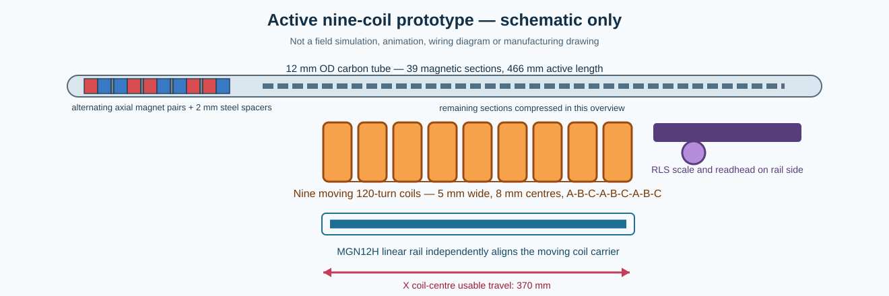

# Tubular linear motor

This repository documents an experimental moving-coil tubular motor for a 3D printer. The **active build** is the nine-coil prototype below. Rev62 and Rev64 assets are preserved as recovered historical material; they are not current drawings, calculations, winding instructions, or simulation results.

> **Build status — not qualified.** The active geometry has not yet passed a physical coil, force, thermal, encoder-field, or long-stroke test. The old Rev64 GIF and Elmer images are archived because their coil geometry and/or field representation are wrong. Do not use them to make engineering decisions.



## Active prototype — one X-axis rail

| Feature | Current definition |
|---|---|
| Usable coil-centre travel | 370 mm |
| Magnet rod | 39 sections, 466 mm active stack |
| Each section | Two Ø10 × 5 mm axially magnetised N42SH discs, joined N-to-S |
| Spacer | Ø10 × Ø8 × 2 mm low-carbon-steel washer between sections |
| Section pitch | 12 mm |
| Tube | Carbon fibre Ø12 OD × Ø11 ID; buy 500 mm and trim after retention proof |
| Moving coil pack | **9 independent air coils**, 69 mm overall length |
| Each coil | 13 mm bore × 5 mm width, 120 turns AWG25 |
| Wire | 0.455 mm bare / about 0.496 mm finished; prepare 7.5 m per coil |
| Phase order | A–B–C–A–B–C–A–B–C; three series coils per phase |
| Controller | One MKS XDrive 3.6 channel at 48 V; braking resistor required |
| Feedback | RLS RLC2HD / MS05, mounted on the rail side away from the motor field |

The schematic shows intended physical arrangement only. It is not a field plot, animation, force prediction, wiring diagram, or manufacturing drawing.

## Current build documents

1. [Current prototype definition](docs/11-current-build.md) — mechanical, coil, thermal and encoder decisions.
2. [One-rail BOM](docs/12-one-rail-bom.md) — purchase/build list for the 370 mm X rail.
3. [Current winding recipe](winding-machine/docs/CURRENT_120T_AWG25_RECIPE.md) — setup and trial measurements.
4. [Current build records](records/README.md) — winding, force, thermal and release records.
5. [Project audit and withdrawn simulations](docs/13-project-audit.md) — what is historical and why.

## Historical recovered material

- [Rev62/Rev64 history](docs/02-history.md), preserved for provenance.
- [Archived CAD](cad/) and [archived FEMM work](simulation/rev64/), which do **not** match the active nine-coil rail.
- [Legacy manual](docs/ENGINEERING_MANUAL.md), which is a frozen Rev64 reference only.
- [Archived visual material](media/README.md), which must not be treated as a simulation.

## Recalculate and check the archived Rev64 references

These commands validate the recovered historical files only; they do not validate the active prototype:

```sh
python tools/calculate.py
python tools/verify.py
python -m unittest discover -s tests -v
```

## Repository layout

```text
bom/                     Current one-rail BOM plus preserved Rev64 BOM
cad/, simulation/rev64/  Historical recovered files; not the active design
concepts/                Exploratory work; check its status before reuse
docs/11-current-build.md Active mechanical/electrical definition
docs/12-one-rail-bom.md  Active X-rail procurement/build list
media/                   Current schematic and withdrawn legacy visuals
records/                 Current prototype test templates
winding-machine/         Winder hardware plus active winding recipe
tools/, tests/           Archived Rev64 reproducibility tools
```

No license has been selected. Keep the project private until ownership and release choices are settled.
