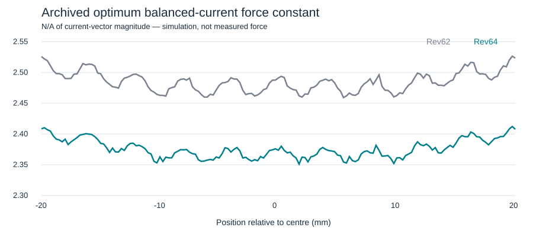

# Generated calculation results

Generated from explicit parameters and archived CSV data. Electrical estimates include the assumed 0.20 m extra wire per coil. Current examples are not operating ratings. Changing geometry does not resimulate the archived force constants.

| Quantity (units in name) | Value |
|---|---:|
| stack length mm | 94 |
| coil pack length mm | 44 |
| bobbin length mm | 45 |
| coil id mm | 13.4 |
| radial window mm | 1.7 |
| window area mm2 | 6.8 |
| coil end margin at full travel mm | 5 |
| bobbin end margin at full travel mm | 4.5 |
| magnet to tube radial gap mm | 0.1 |
| tube to bobbin radial gap mm | 0.2 |
| wire radial build mm | 1.686 |
| wire axial build mm | 3.934 |
| radial allowance mm | 0.014 |
| axial allowance mm | 0.066 |
| finished diameter geometric ceiling mm | 0.283333333 |
| bare copper area mm2 | 0.0490873852 |
| cross section copper fill fraction | 0.57749865 |
| winding wire length per coil m | 3.78446304 |
| wire length with allowance per coil m | 3.98446304 |
| six coil wire consumption m | 23.9067782 |
| six coil purchase with waste m | 28.6881339 |
| six coils plus trial purchase m | 33.4694895 |
| coil resistance20 ohm | 1.38739003 |
| coil resistance20 low ohm | 1.33280289 |
| coil resistance20 high ohm | 1.44556319 |
| phase resistance20 ohm | 2.77478006 |
| star line line resistance20 ohm | 5.54956012 |
| six coil copper mass including allowance g | 10.444339 |
| bobbin volume mm3 | 2605.38562 |
| single coil envelope volume mm3 | 322.578734 |
| Rev64 k vector mean N per A | 2.37572205 |
| Rev64 k vector min N per A | 2.35104849 |
| Rev64 k vector max N per A | 2.41217428 |
| Rev64 k phase peak equivalent mean N per A | 2.90965339 |
| Rev64 k phase peak equivalent min N per A | 2.87943458 |
| Rev62 k vector mean N per A | 2.48520218 |
| mean k change percent | -4.4052805 |
| kf peak to peak over mean percent | 2.57293523 |
| historical horizontal inertia force N | 2.593 |
| historical vertical upward force no friction N | 7.496325 |
| historical horizontal equivalent peak current A | 0.900524018 |
| historical vertical equivalent peak current A | 2.60340174 |
| historical vertical hold force N | 4.903325 |
| max absolute phase back emf V per m s | 2.15925941 |
| max absolute line back emf V per m s | 3.38217876 |

## Current examples — not approved limits

| Equivalent phase peak A | Vector A | Minimum archived force N | Copper loss at 20°C W | Phase RMS current density A/mm² |
|---:|---:|---:|---:|---:|
| 0.1 | 0.12247 | 0.28794 | 0.041622 | 1.4405 |
| 0.5 | 0.61237 | 1.4397 | 1.0405 | 7.2025 |
| 0.75 | 0.91856 | 2.1596 | 2.3412 | 10.804 |
| 1 | 1.2247 | 2.8794 | 4.1622 | 14.405 |
| 1.5 | 1.8371 | 4.3192 | 9.3649 | 21.608 |
| 2 | 2.4495 | 5.7589 | 16.649 | 28.81 |

Resistance and loss rise with temperature. Force uses a first-pass magnetic model with no temperature derating.

