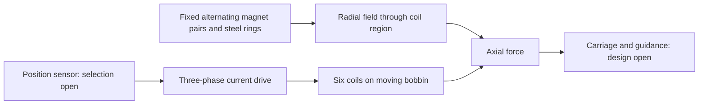

# Design and coordinate system

> **Historical Rev64 reference — not the active build.** This file describes the recovered six-coil / 80-turn Rev64 concept. It does not define the current nine-coil prototype. Use [the current prototype definition](11-current-build.md), [one-rail BOM](12-one-rail-bom.md), and [project audit](13-project-audit.md) for active work.

## Architecture

The permanent-magnet/steel stack and carbon tube are stationary. Six wound coils and their common nonmagnetic bobbin move along Z. FEMM uses an axisymmetric cross-section with horizontal coordinate r and vertical coordinate z; the CAD axis is Z. All geometry files use millimetres. Force derivatives convert displacement to metres.

The carbon tube separates the magnet stack from the bobbin bore. A bore clearance is not a designed bearing: radial guidance, concentricity and lateral load capacity remain unspecified.

## Parts and datums

| Item | Geometry / position |
|---|---|
| Magnet pairs | Eight 10 mm sections; each made from two Ø10 × 5 mm discs |
| Pair centres | Z = −42, −30, −18, −6, 6, 18, 30, 42 mm |
| Magnetization | First pair +Z, then −Z, +Z, −Z, +Z, −Z, +Z, −Z |
| Pole rings | Ø10 outside, Ø5 bore, 2 mm thick, centres −36, −24, −12, 0, 12, 24, 36 mm |
| Stack and tube ends | Z = −47 and +47 mm |
| Coil centres | Z = −20, −12, −4, 4, 12, 20 mm at displacement zero |
| Bobbin ends | Z = −22.5 and +22.5 mm at displacement zero |
| Coil pack ends | Z = −22 and +22 mm at displacement zero |

Both discs in each pair have the same axial magnetization. The CAD treats their interface as zero thickness. Adhesive or actual gaps must be added to the stack tolerance and electromagnetic models if used. Magnetization direction is a vector; an N/S marking procedure must be established and verified with a known pole reference before assembly.

The nominal assembly has 31 solids: 16 magnets + 7 steel rings + 1 tube + 6 winding envelopes + 1 bobbin. The winding envelopes occupy the allowable winding volume, not the actual copper fill. Their volume cannot be multiplied by copper density to obtain actual winding mass.

## Geometric travel

At either ±20 mm extreme, the farthest winding edge is 42 mm from the stack centre, leaving 5 mm to the stack end. The bobbin edge reaches 42.5 mm, leaving 4.5 mm. These are axial overlap margins only. The original commissioning notes proposed initial ±18 mm soft limits; these remain a proposed commissioning setting pending end-stop and encoder design.

## Reference envelope

The Ø17 bore / Ø23 outside annulus is unassigned FEMM reference geometry and is excluded from the physical STEP assembly. No steel yoke or centre through-rod is established by the source model. Introducing either requires a fresh electromagnetic and mechanical evaluation.

