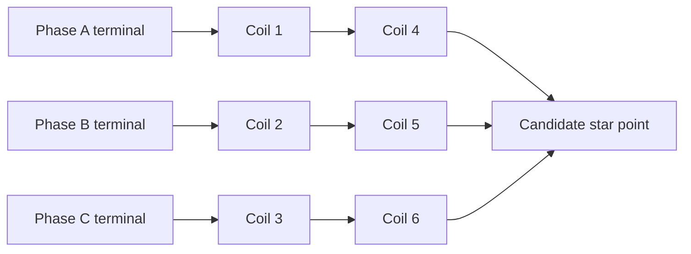

# Winding and electrical connections

> **Historical Rev64 reference — not the active build.** This file describes the recovered six-coil / 80-turn Rev64 concept. It does not define the current nine-coil prototype. Use [the current prototype definition](11-current-build.md), [one-rail BOM](12-one-rail-bom.md), and [project audit](13-project-audit.md) for active work.

## First-coil wire specification

Request solid enamelled copper magnet wire with 0.250 mm nominal bare conductor, Grade 1 insulation and a supplier-guaranteed finished diameter ≤0.281 mm. Ask for the insulation chemistry, thermal class, resistance per metre, batch certificate and handling/termination guidance. Thermal class and enamel grade are different specifications. Final thermal class must be compatible with the selected bobbin, adhesive and temperature envelope.

The manufacturer's IEC table lists Grade 1 finished diameter 0.267–0.281 mm and nominal resistance 0.3482 Ω/m for 0.250 mm copper. [Elektrisola diameter/resistance table](https://www.elektrisola.com/Attachments/TechnicalDataBySize/ELEKTRISOLA_EnCuWire_IECJIS_Datasheet_eng.pdf).

Generic AWG30, Grade 2 or self-bonding wire must not be accepted by name alone. Additional coatings count toward finished diameter. A 20–25 m trial spool permits several winding attempts, but it is not the calculated procurement quantity for all six production coils plus a trial.

## Single-pocket trial

1. Identify the bobbin process/material and measure the actual bore, base diameter and pocket width. Design a smooth lead exit and crossover route before winding. The original CAD does not contain those routes.
2. Record wire supplier and lot. Check finished diameter at multiple positions using suitable low-force measurement. Keep the supplier's maximum specification as the procurement requirement.
3. Label start and finish leads. Define and photograph the winding direction from a stated viewing end; do not rely on an ambiguous clockwise instruction.
4. Trial the six-layer plan, counting 14, 14, 13, 13, 13, 13 turns from inner to outer layers. Record actual build after each layer. Use supplier-compatible tension and avoid damaging enamel at flange edges.
5. Record final OD, width, turn count and resistance at a measured temperature. Compare against the calculation with actual lead length.
6. Inspect insulation integrity and lead strain relief before impregnation. Select an insulation test method/voltage compatible with the actual insulation system and equipment; none is prescribed by the recovered design.
7. Confirm fit after the intended impregnation/cure process. Use the trial record to release or redesign the pocket. Do not force an oversized winding into the envelope.

## Phase mapping

| Coil | Centre at zero, mm | Phase | Proposed pair |
|---|---:|---|---|
| C1 | −20 | A | C1 + C4 in series |
| C2 | −12 | B | C2 + C5 in series |
| C3 | −4 | C | C3 + C6 in series |
| C4 | 4 | A | C1 + C4 in series |
| C5 | 12 | B | C2 + C5 in series |
| C6 | 20 | C | C3 + C6 in series |

Each FEMM label has +80 turns. A matched physical winding direction and additive series connection must reproduce that sign convention. Confirm induced-voltage polarity or restrained low-current force direction before making final series joints. A model's positive turns do not identify physical start/finish terminals by themselves.

This is a proposed star topology for planning, not a recovered terminal drawing. Controller compatibility, neutral treatment and verified series polarity are required before wiring release. Keep individual coil leads accessible during the trial stage. All current and resistance calculations state their topology explicitly.

