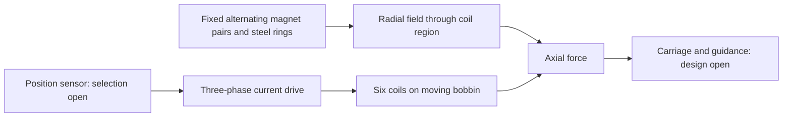
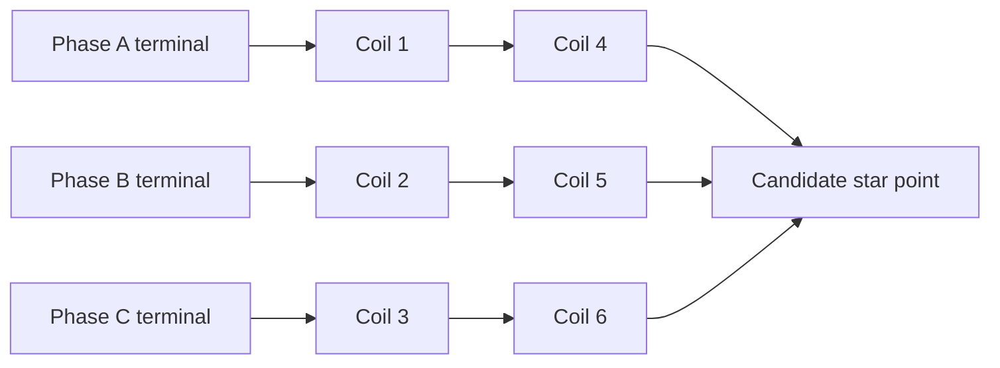

# Tubular linear motor — engineering manual

> **Historical Rev64 reference — not the active build.** This file describes the recovered six-coil / 80-turn Rev64 concept. It does not define the current nine-coil prototype. Use [the current prototype definition](11-current-build.md), [one-rail BOM](12-one-rail-bom.md), and [project audit](13-project-audit.md) for active work.

Revision 64 documentation, with Revision 62 history. Prototype definition; no physical qualification established.

See [repository overview](../README.md) and [generated calculations](../calculations/results.md).


---

## Design and coordinate system

### Architecture

The permanent-magnet/steel stack and carbon tube are stationary. Six wound coils and their common nonmagnetic bobbin move along Z. FEMM uses an axisymmetric cross-section with horizontal coordinate r and vertical coordinate z; the CAD axis is Z. All geometry files use millimetres. Force derivatives convert displacement to metres.

The carbon tube separates the magnet stack from the bobbin bore. A bore clearance is not a designed bearing: radial guidance, concentricity and lateral load capacity remain unspecified.



### Parts and datums

| Item | Geometry / position |
|---|---|
| Magnet pairs | Eight 10 mm sections; each made from two Ø10 × 5 mm discs |
| Pair centres | Z = −42, −30, −18, −6, 6, 18, 30, 42 mm |
| Magnetization | First pair +Z, then −Z, +Z, −Z, +Z, −Z, +Z, −Z |
| Pole rings | Ø10 outside, Ø5 bore, 2 mm thick, centres −36, −24, −12, 0, 12, 24, 36 mm |
| Stack and tube ends | Z = −47 and +47 mm |
| Coil centres | Z = −20, −12, −4, 4, 12, 20 mm at displacement zero |
| Bobbin ends | Z = −22.5 and +22.5 mm at displacement zero |
| Coil pack ends | Z = −22 and +22 mm at displacement zero |

Both discs in each pair have the same axial magnetization. The CAD treats their interface as zero thickness. Adhesive or actual gaps must be added to the stack tolerance and electromagnetic models if used. Magnetization direction is a vector; an N/S marking procedure must be established and verified with a known pole reference before assembly.

The nominal assembly has 31 solids: 16 magnets + 7 steel rings + 1 tube + 6 winding envelopes + 1 bobbin. The winding envelopes occupy the allowable winding volume, not the actual copper fill. Their volume cannot be multiplied by copper density to obtain actual winding mass.

### Geometric travel

At either ±20 mm extreme, the farthest winding edge is 42 mm from the stack centre, leaving 5 mm to the stack end. The bobbin edge reaches 42.5 mm, leaving 4.5 mm. These are axial overlap margins only. The original commissioning notes proposed initial ±18 mm soft limits; these remain a proposed commissioning setting pending end-stop and encoder design.

### Reference envelope

The Ø17 bore / Ø23 outside annulus is unassigned FEMM reference geometry and is excluded from the physical STEP assembly. No steel yoke or centre through-rod is established by the source model. Introducing either requires a fresh electromagnetic and mechanical evaluation.


---

## Revision history and workbook audit

### Revision 62 to Revision 64

| Parameter | Rev62 | Rev64 |
|---|---:|---:|
| Bobbin bore, mm | 12.4 | 12.4 |
| Bobbin base wall, mm | 0.10 | 0.50 |
| Winding inside diameter, mm | 12.6 | 13.4 |
| Winding outside diameter, mm | 16.8 | 16.8 |
| Radial winding window, mm | 2.1 | 1.7 |
| Axial winding window, mm | 4 | 4 |
| Window area, mm² | 8.4 | 6.8 |
| Turns per coil | 80 | 80 |
| Coil pitch, mm | 8 | 8 |

The wall is five times as thick; available winding-window cross-section decreases by 19.0476%. Increased wall thickness is not itself proof of adequate strength. The magnet stack, carbon tube, coil axial positions and nominal travel are unchanged. The archived mean force constant falls from 2.485202 to 2.375722 N/A of current-vector magnitude, a 4.4053% decrease.

Revision 62 CAD is already centred, but its original parent FEMM coil centres were 16, 24, 32, 40, 48, 56 mm. Its sweep translated the pack by −36 mm. Revision 64 FEMM is already centred; repeating that translation is incorrect.

### What the recovered workbook establishes

The preserved `archive/recovered-history/Rev62_build_and_commissioning_log.xlsx` was inspected across all five worksheets. It is a commissioning template, not evidence of a completed build.

| Sheet / cells | Findings and implications |
|---|---|
| Baseline B9:B15 | 0.10 mm wall, 6.3 mm copper start radius, 2.1 mm radial window and generic AWG30 candidate are Rev62 values. They must not be applied to Rev64. |
| Baseline B19:B21 | Historical target mass 0.5 kg and acceleration 5.186 m/s² imply 2.593 N inertia-only thrust. Orientation, friction and total moving mass need confirmation. |
| Baseline B22:B25 | 0.75, 1.5, 2.0 and 2.5 A phase-peak entries are proposed test/candidate values, not approved ratings. |
| Build QC D7:D12; E17:K23 | Actual dimensions, winding counts, resistances and insulation results are empty. Status entries are Pending. |
| Build QC C18:C23 | Coil positions use the old uncentred FEMM frame (16 to 56 mm). New records use centred coordinates. |
| Thermal Log B34:B36 | 2.63 Ω is an estimated phase resistance, 120°C is an old proposed copper limit, and <1°C rise over 10 minutes is an old steady-state criterion. None proves safe operation. |
| Thermal Log rows 6:30 | Raw test inputs are blank. Formulas are present, but no measured thermal run is recorded. |
| Force Travel rows 6:8 | Measured F+ and F− are blank. Force targets and current vectors belong to the earlier revision. |
| Release rows 6:15 | Every disposition is Pending; no release evidence is filled. |

The old thermal temperature estimate divides by an estimated reference resistance. For new tests, measure the same winding's resistance and reference temperature first. The old force target cells are constants and do not automatically scale if the current input changes. New record guidance requires recalculating each target for the actual current and position.

### Recovery provenance

The recovered Rev62 parent FEMM file exactly matches the SHA-256 parent fingerprint recorded in Rev64's source check. The Rev62 CAD README in the later supplied archive is identical to the earlier recovered note. Raw source files are preserved without revision substitutions. Revision 63 direct-force files are retained as history and are not used as Rev64 results.


---

## Calculations and assumptions

Run `python tools/calculate.py` from the repository root to generate [results](../calculations/results.md) and [machine-readable values](../calculations/results.json). Inputs are in [parameters.json](../calculations/parameters.json). The calculator rejects impossible layer counts and gross overfill; passing those checks does not prove a manufacturable winding.

### Source hierarchy and units

Geometry comes from Rev64 CAD parameters and FEMM coordinates. Force comes from archived simulation CSVs. Wire dimensions and resistance per metre come from the linked Elektrisola IEC table. Extra lead length, procurement allowance, copper density and temperature coefficient are explicitly stated estimates. The historical mass and acceleration are workbook targets, not newly confirmed requirements. SI units are used for electromagnetic and dynamic equations; geometry uses mm with explicit conversions.

### Geometry

Let N_c be coil count, p coil pitch, w coil width, t bobbin wall and D_b bobbin bore.

- Stack length = 16 × 5 + 7 × 2 = 94 mm.
- Coil-pack length = (N_c − 1)p + w = 44 mm.
- Bobbin length = 44 + 2 × 0.5 = 45 mm.
- Coil ID = D_b + 2t = 13.4 mm.
- Radial window h = (16.8 − 13.4)/2 = 1.7 mm.
- Window cross-section = wh = 6.8 mm².
- Minimum winding end margin = 94/2 − 20 − 44/2 = 5 mm.
- Minimum bobbin end margin = 94/2 − 20 − 45/2 = 4.5 mm.
- Magnet-to-tube radial gap = (10.2 − 10)/2 = 0.10 mm.
- Tube-to-bobbin radial gap = (12.4 − 12)/2 = 0.20 mm.

For an annular component, V = π(D_o² − D_i²)L/4. Use D_i = 0 for a solid magnet disc. Bobbin volume equals the base sleeve plus the radial material above the base over the five 4 mm lands and two 0.5 mm flanges. Source component volumes are independently checked against these formulas.

### Winding fit

At finished wire diameter d_f = 0.281 mm, the ordered rectangular plan is 14 + 14 + 13 + 13 + 13 + 13 = 80 turns. Six layers occupy 6d_f = 1.686 mm radially. The widest layer occupies 14d_f = 3.934 mm axially. Nominal allowances are 0.014 mm radially and 0.066 mm axially.

The purely geometric diameter ceiling is min(1.7/6, 4/14) = 0.283333 mm, before any allowance. The specified 0.281 mm maximum is below that ceiling but only barely. Real crossovers, irregular stacking, enamel variation, bobbin tolerance and impregnation consume clearance. No extra insulation or adhesive allowance is built into the nominal fit.

Bare copper area A = πd_bare²/4 = 0.0490874 mm². Cross-sectional copper fill fraction = 80A/(4 × 1.7) ≈ 57.75%. This area fraction does not describe packing difficulty by itself. It also is not exactly the winding-volume fill when the turn counts vary by layer radius.

### Wire length, resistance and mass

For layer j starting at zero, centre diameter D_j = D_coil_ID + (2j + 1)d_f. Approximate turn length is πD_j. The model uses L_winding = Σ(n_j πD_j)/1000 metres. It neglects the tiny helical correction and excludes crossovers and terminals.

The explicit allowance is 0.20 m extra wire per coil. This is a planning input, not a recovered lead-routing dimension. Total wire per coil = L_winding + allowance. Production consumption is six times that value. A separate 20% procurement allowance is applied only to purchase length, not electrical resistance or copper mass. One trial coil adds its own consumption before that allowance.

R_coil,20 = wire length × 0.3482 Ω/m. The supplier table's 0.3345–0.3628 Ω/m range produces an estimated resistance band for the same length. Each series phase has two coils, so R_phase = 2R_coil, plus any extra interconnect resistance not included in the allowance. For a balanced star connection measured between two terminals with the third open, R_line-line = 2R_phase. These relations do not apply unchanged to delta wiring.

Copper mass = A × length × density after unit conversion. Density 8.9 g/cm³ is an estimate. Insulation, solder, lead dress, bobbin, carriage and adhesive are excluded. Bobbin CAD volume is available, but bobbin mass remains V × selected-material density. Total moving mass is unavailable until the mechanical BOM is specified.

### Force and current definitions

For phase permanent-magnet flux linkages λ_A, λ_B, λ_C in Wb-turn and displacement x in metres, define g = dλ/dx. Remove the common-mode component: p = g − mean(g)[1,1,1]. Then K = ||p||₂ and u = p/K. The optimum balanced current is i = I_vector u, satisfying sum(i) = 0 and ||i||₂ = I_vector. Its PM force prediction is F = g·i = K I_vector.

The archived script uses centred differences at interior samples and one-sided differences at ±20 mm. Displacement spacing is 0.25 mm. These gradients and normalized currents are checked again from the saved flux data.

For the conventional balanced sinusoidal scaling, I_vector = sqrt(3/2) I_phase_peak, and each phase RMS over a sinusoidal cycle is I_phase_peak/sqrt(2). Therefore K_phase_peak_equivalent = sqrt(3/2) K. The saved optimum vectors are not a guarantee that an arbitrary fixed sinusoidal commutation law produces the same force. At standstill, the individual DC phase values differ from their over-cycle RMS values. Always state which current convention is used.

Direct-force validation uses F_PM_odd = [F(+i) − F(−i)]/2 and F_even = [F(+i) + F(−i)]/2. Relative difference = 100(F_PM_odd − K)/K for the saved unit-vector currents. Three checks are consistency evidence, not a full mesh-convergence study or measured force map.

### Copper loss and temperature

For equal phase resistance R_phase and arbitrary instantaneous currents, P_copper = R_phase(i_A² + i_B² + i_C²) = R_phase I_vector². Under equivalent sinusoidal phase-peak scaling this becomes 1.5 R_phase I_phase_peak². Current scenarios in the generated table are arithmetic examples, not approved operating limits.

R(T) = R20[1 + α(T − 20°C)], using α = 0.00393/K as an estimate. A measured reference at T_ref gives T = 20 + {(R/R_ref)[1 + α(T_ref − 20)] − 1}/α. Measure after settling and account for lead/contact resistance. This estimates average copper temperature, not the hottest turn.

At thermal steady state, Rθ ≈ (T − T_ambient)/P. With equal phase resistances, a provisional current calculation would be I_phase_peak ≤ sqrt[(T_limit − T_ambient)/(1.5 R_phase(T_limit) Rθ)]. Rθ, ambient worst case, material-compatible T_limit and duty cycle are missing, so no continuous-current result is assigned. The old 120°C workbook entry is not an approved limit.

### Load, acceleration and orientation

Historical targets give F_inertia = ma = 0.5 × 5.186 = 2.593 N. A vertical upward acceleration requires F = m(a + g) + friction + external load; with gravity alone added, F = 7.496325 N. Horizontal force ignores gravity along the axis but still needs friction and cable load. The generated estimates divide these loads by the minimum archived K to show conservative position-based current within this first-pass simulation. They do not include a design margin or magnetic-temperature derating.

Holding force on a vertical axis is mg even at zero acceleration. A commanded current failure cannot be treated as a holding brake. Orientation must be confirmed before accepting an operating envelope.

### Back EMF, voltage and missing dynamic calculations

For each phase, e_j = (dλ_j/dx)v. The relevant line voltage is e_A − e_B, etc. The generated results report the largest absolute saved phase and line gradient, which give voltage per m/s. Multiplying the projected force constant by velocity does not automatically give a phase-to-phase back-EMF value.

General phase voltage is v = Ri + d(Li)/dt + e_PM, with mutual terms in the inductance matrix and position dependence if present. A first current-ramp estimate is di/dt ≈ (V_available − Ri − e)/L only after defining the electrical circuit and inductance. The 12 mm adjacent-pair pitch implies a nominal 24 mm magnetic period, so f_e ≈ |velocity|/0.024 m away from end effects. Full force commutation should use a calibrated position/phase map.

Inductance matrix, bus voltage, maximum speed, PWM ripple, eddy losses, saturation, magnetic temperature effects, fatigue life, structural deflection and a thermal duty rating cannot be calculated numerically from the supplied evidence. Required inputs and tests are listed in the roadmap; no guessed values are presented as results.


---

## Bill of materials and procurement

This is a complete register of known parts and unresolved systems, not a fully orderable production BOM. Blank prices and supplier fields mean unknown, not zero. No total build cost can be stated until those items are selected. The machine-readable [BOM](../bom/bom.json) retains supplier, part-number and cost fields for future quotes.

| ID | Item | Quantity | Specification | Status |
|---|---|---:|---|---|
| MAG-01 | Axially magnetized disc magnet | 16 each | Ø10 × 5 mm; N42SH model label; coating and supplier properties pending | Geometry defined; material certificate needed |
| POL-01 | Steel pole ring | 7 each | Ø10 OD × Ø5 ID × 2 mm; steel grade/B-H curve pending | Geometry defined; alloy pending |
| TUB-01 | Carbon tube | 1 each | Ø12 OD × Ø10.2 ID × 94 mm; layup and tolerances pending | Nominal geometry defined |
| BOB-01 | Six-pocket bobbin | 1 each | Ø12.4 ID, Ø13.4 base OD, Ø16.8 lands, 45 mm length; material/process/routes pending | Provisional custom part |
| WND-01 | Wound coil | 6 each | 80 turns; 4 mm width; Ø13.4–16.8 mm envelope | Trial winding required |
| WIRE-01 | Enamelled copper wire | TBD m | 0.250 mm bare; Grade 1; ≤0.281 mm finished; see calculated procurement length | Trial purchase only; full-build quantity calculated |
| BOB-TRIAL | Single-pocket trial former | 1 each | Rev64 pocket dimensions; actual lead/crossover design required | Additional prototype tooling; CAD not supplied |
| ADH-01 | Adhesive / impregnation | TBD quantity TBD | Compatibility, cure and thickness to be selected | Open |
| RET-01 | Stack retention and assembly fixture | TBD set TBD | End retention, magnet forces and tolerances to be designed | Open |
| GUIDE-01 | Linear guidance and carriage | TBD set TBD | Travel/load/stiffness, attachment and alignment to be specified | Open |
| STOP-01 | Mechanical stops and limit system | TBD set TBD | Usable stroke and failure behaviour to be specified | Open |
| LEAD-01 | Lead harness and terminals | TBD set TBD | Flexible leads, strain relief, connectors and phase topology to be detailed | Open |
| ENC-01 | Position sensor and mount | TBD set TBD | Accuracy, resolution, interface and datum pending | Open |
| DRV-01 | Three-phase current controller | 1 set | Current convention, inductance, bus voltage and encoder compatibility pending | Selection open; no rated current established |
| PSU-01 | Power supply and electrical protection | 1 set | Bus voltage/current, energy handling and protection pending | Selection open |
| TEMP-01 | Temperature sensors | TBD quantity TBD | Sensor placement, range and electrical isolation pending | Open |
| TEST-01 | Test equipment | 1 set | Suitable micrometer, resistance instrument, calibrated load cell, current measurement and temperature logging | Equipment checklist; not motor mass |

WND-01 is the wound subassembly and WIRE-01 is its raw material: do not count both as purchased finished coils plus purchased winding wire unless intentionally outsourcing spares. The trial former is additional tooling, not part of the 31-solid assembly. The reference annulus is excluded from the BOM.

Use the generated calculations for wire consumption and the separate full-build-plus-trial purchase allowance. Obtain a small trial spool before a production order. Confirm magnet coating dimensions, actual tube tolerances and bobbin process before releasing custom parts.


---

## Winding and electrical connections

### First-coil wire specification

Request solid enamelled copper magnet wire with 0.250 mm nominal bare conductor, Grade 1 insulation and a supplier-guaranteed finished diameter ≤0.281 mm. Ask for the insulation chemistry, thermal class, resistance per metre, batch certificate and handling/termination guidance. Thermal class and enamel grade are different specifications. Final thermal class must be compatible with the selected bobbin, adhesive and temperature envelope.

The manufacturer's IEC table lists Grade 1 finished diameter 0.267–0.281 mm and nominal resistance 0.3482 Ω/m for 0.250 mm copper. [Elektrisola diameter/resistance table](https://www.elektrisola.com/Attachments/TechnicalDataBySize/ELEKTRISOLA_EnCuWire_IECJIS_Datasheet_eng.pdf).

Generic AWG30, Grade 2 or self-bonding wire must not be accepted by name alone. Additional coatings count toward finished diameter. A 20–25 m trial spool permits several winding attempts, but it is not the calculated procurement quantity for all six production coils plus a trial.

### Single-pocket trial

1. Identify the bobbin process/material and measure the actual bore, base diameter and pocket width. Design a smooth lead exit and crossover route before winding. The original CAD does not contain those routes.
2. Record wire supplier and lot. Check finished diameter at multiple positions using suitable low-force measurement. Keep the supplier's maximum specification as the procurement requirement.
3. Label start and finish leads. Define and photograph the winding direction from a stated viewing end; do not rely on an ambiguous clockwise instruction.
4. Trial the six-layer plan, counting 14, 14, 13, 13, 13, 13 turns from inner to outer layers. Record actual build after each layer. Use supplier-compatible tension and avoid damaging enamel at flange edges.
5. Record final OD, width, turn count and resistance at a measured temperature. Compare against the calculation with actual lead length.
6. Inspect insulation integrity and lead strain relief before impregnation. Select an insulation test method/voltage compatible with the actual insulation system and equipment; none is prescribed by the recovered design.
7. Confirm fit after the intended impregnation/cure process. Use the trial record to release or redesign the pocket. Do not force an oversized winding into the envelope.

### Phase mapping

| Coil | Centre at zero, mm | Phase | Proposed pair |
|---|---:|---|---|
| C1 | −20 | A | C1 + C4 in series |
| C2 | −12 | B | C2 + C5 in series |
| C3 | −4 | C | C3 + C6 in series |
| C4 | 4 | A | C1 + C4 in series |
| C5 | 12 | B | C2 + C5 in series |
| C6 | 20 | C | C3 + C6 in series |

Each FEMM label has +80 turns. A matched physical winding direction and additive series connection must reproduce that sign convention. Confirm induced-voltage polarity or restrained low-current force direction before making final series joints. A model's positive turns do not identify physical start/finish terminals by themselves.



This is a proposed star topology for planning, not a recovered terminal drawing. Controller compatibility, neutral treatment and verified series polarity are required before wiring release. Keep individual coil leads accessible during the trial stage. All current and resistance calculations state their topology explicitly.


---

## Mechanical assembly and tolerances

### Nominal geometry is not a shop drawing

The CAD includes five full-width 4 mm separator lands and two 0.5 mm end flanges. These were provisional additions in Rev62 and remain provisional in Rev64. Bobbin material candidates PEEK or G10 appear in the old workbook; neither is a selected, qualified process for this geometry.

Define manufacturing tolerances on the actual drawing before ordering final custom parts. In particular, Ø12.4 bore and Ø12 tube give only 0.20 mm nominal radial clearance. Tube straightness, ovality, bobbin shrinkage, guidance alignment and temperature expansion all contribute to minimum running clearance.

For measured worst-case diameters, radial clearance c_min = (bobbin_ID_min − tube_OD_max)/2 − eccentricity_allowance. Similar stack-to-tube clearance is (tube_ID_min − magnet_OD_max)/2 before coating and assembly allowances. A numerical tolerance budget requires those actual limits.

The nominal winding OD allowance relative to the reference bore is only (17 − 16.8)/2 = 0.10 mm, but no physical reference housing is selected. Do not use this as a verified bearing fit.

### Assembly sequence to develop

1. Inspect magnet dimensions, axial magnetization and pole-ring geometry. Confirm pole material and magnet supplier certificate. Use a suitable fixture for the interacting magnets; the alternating stack contains repelling interfaces and needs defined retention.
2. Define adhesive gaps and end retention, then calculate the assembled stack length and revise CAD/FEMM if the nominal 94 mm changes.
3. Trial the fixed stack inside the measured carbon tube without damaging coatings. Do not treat the Ø5 pole-ring holes as a continuous bore through the solid magnets.
4. Complete the single-pocket winding trial and winding inspection before committing to the six-pocket former.
5. Add coil crossover routes, lead exits and strain relief while preserving the required radial envelope. Record any geometry change as a new revision.
6. Design carriage attachment, guides, end stops and encoder datum together. The winding pack must not carry unspecified lateral loads through rubbing contact with the tube.
7. Confirm free travel and measured margins with the assembled lead harness before electrical commissioning.

This is a development sequence. Detailed retention, guidance and connection drawings remain required for assembly release.

### Material and environment requirements

Record bobbin modulus, creep behaviour and temperature limit; adhesive cure shrinkage and temperature range; tube thermal expansion, straightness and conductivity; magnet temperature-dependent properties and coating. The minimum compatible limit of the insulation/material system constrains operation. Carbon composite properties depend on layup, so a generic isotropic assumption does not establish thermal or mechanical performance.

Mass, stiffness, buckling, bearing life and fatigue calculations are pending the carriage, support spans, material properties, load directions and duty cycle. Do not substitute the 0.5 kg historical carriage target for a measured moving assembly mass.


---

## Simulation and reproduction

### Archived model

The preserved Rev64 FEMM file is a static axisymmetric model in millimetres with precision 1e−8, a zero-vector-potential outer boundary and an approximately r = 0–30 mm, z = −60–60 mm air domain. All six coils are group 100. Their radii are 6.7–8.4 mm and their centres are −20, −12, −4, 4, 12, 20 mm. The saved starting phase currents are −1, +0.5, +0.5 A; the sweep resets them to zero.

| Material | Saved model assumption |
|---|---|
| Air and implicit bobbin | Relative permeability 1 |
| CarbonTube | Relative permeability 1, conductivity 0 |
| Steel_firstpass | Constant relative permeability 1000, no B–H points |
| N42SH_firstpass | Relative permeability 1.05, coercive field 1,000,000 A/m |
| Copper | Conductivity 58 MS/m; no explicit individual-wire geometry |

The magnetic material label is not a verified supplier material curve. The model omits thermal feedback, real steel saturation, magnet temperature dependence, PWM and conductive carbon-tube losses. Treat winding resistance from physical wire geometry and measurements separately from a homogenized coil-region solution.

### What the archived sweep does

It translates the whole coil group through 161 positions at 0.25 mm increments over ±20 mm, extracts zero-current PM circuit flux linkages, differentiates them and calculates balanced optimum current vectors. It then solves positive and negative currents at −20, 0 and +20 mm and integrates axial Lorentz force on all six coil regions.

FEMM `mo_blockintegral(12)` is the steady-state axial Lorentz-force component for an axisymmetric magnetic model. The official [FEMM manual](https://www.femm.info/Archives/doc/manual.pdf) documents the integral and circuit-property APIs. The air-like coil permeability makes this force calculation appropriate for the coil regions.

The saved direct-force comparisons are within 0.35%; the largest even component is about 0.000059 N. Recalculation of saved data is not a new finite-element solve. Archived CAD-kernel reimport checks are also preserved evidence, not rerun by the documentation tools.

### Fresh runs without overwriting the archive

The preserved Lua uses absolute paths from its original computer location. Do not run it in place. Instead:

```sh
python tools/prepare_femm.py --output work/femm-trial-01
```

The tool creates a new directory, copies the centred model, adapts only the input/output paths in a copied Lua script, and removes automatic application exit. It refuses an existing output directory. Open FEMM and use its Lua script command to select the generated script. The script creates new CSVs inside the run directory. The original simulation directory stays untouched.

Do not apply the older −36 mm translation to this already-centred model. Wait for the run's `progress.txt` to report completion. Archive the new model, outputs, solver version and machine/run notes together. The run preparation tool has been checked for file isolation; the resulting Lua has not been executed as part of this documentation task.

### Before treating force as a release value

Perform mesh refinement and air-boundary sensitivity studies, compare central and endpoint differentiation schemes, add supplier magnetic curves and temperature cases, check proposed metal fixtures, measure force at known phase currents and positions, and resolve the actual drive's commutation law. Losses and dynamics require additional models and measurements. Model convergence at a numerical precision setting alone does not establish physical accuracy.


---

## Commissioning and measurement records

The recovered workbook contains no completed test evidence. Use the empty [Rev64 record templates](../records/README.md) for new measurements. Every measurement needs a build identifier, revision, date, instrument and calibration/reference information. Preserve raw readings separately from calculations.

### Stage 1: winding and mechanical fit

Record actual wire diameter, bobbin dimensions, layer count, turn count, final OD/width, lead length, resistance and measurement temperature. Inspect insulation and strain relief. Confirm the intended cure does not cause interference. Release the six-coil build only after the single-pocket trial passes a defined drawing and electrical inspection.

### Stage 2: phase and encoder verification

Confirm each series pair's polarity. Measure all coil resistances individually before joining, then each phase and line-to-line resistance under the selected topology. Record reference temperatures. Verify the encoder datum at magnetic centre and restrained motion direction. Initial ±18 mm soft limits are historical proposals; establish mechanical stops and verify usable travel before adopting them.

### Stage 3: static force

Use a restrained fixture and calibrated load cell. Record actual IA, IB, IC, position, F+ and F−, including force sign and zero offset. Obtain the current vector for the actual position from Rev64 data and state the scale. Compute F_pred = g·i, F_odd = (F+ − F−)/2 and F_even = (F+ + F−)/2. Use the same coordinate and force sign conventions throughout.

The saved file's IA_norm/IB_norm/IC_norm entries have unit vector magnitude, not unit phase peak. For equivalent phase-peak scale Ipk, multiply them by sqrt(3/2)Ipk. Recalculate the predicted target if current changes. Do not copy the old workbook's fixed Rev62 target numbers into a new run.

### Stage 4: thermal characterization

Select compatible material temperature limits and an initial restrained, current-limited test plan before applying power. The old workbook's current candidates and 120°C entry are not approved Rev64 settings. Record waveform, all relevant currents, ambient, elapsed time, duty, coil sensor temperatures, phase resistance, reference resistance/temperature, assembly state and stop reason.

Calculate copper loss from actual phase currents and temperature-corrected resistances. For unequal phase resistances, sum R_A i_A² + R_B i_B² + R_C i_C². Resistance thermometry estimates average winding temperature. A surface NTC and a resistance estimate can miss a local hot spot, so record both where available.

The old <1°C over 10 minutes criterion may be a useful proposed stability check, but dwell time and acceptable drift must be specified for the finished assembly. Establish thermal resistance only from stable readings with known mounting and ambient conditions. Current promotion needs measured evidence, not extrapolation from a short cold pulse.

### Release evidence

Before declaring continuous or peak ratings, close winding fit, all coil inspections, polarity, guidance, retention, limits, force mapping, thermal characterization and controller protection. Peak current needs an explicit duration, repetition/duty, starting temperature and cooling condition. Continuous force needs a defined ambient and mounting arrangement. Record unresolved deviations and do not label a pending item as passed.


---

## Open decisions and milestones

| ID | Decision / work | Required evidence | Status |
|---|---|---|---|
| M1 | Confirm axis orientation, moving mass, acceleration and stroke | Updated requirements including gravity, friction and cable forces | Open |
| M2 | Qualify wire and single-pocket winding | Supplier certificate and measured 80-turn sample after cure | Open |
| M3 | Detail bobbin and crossover channels | Material/process choice, tolerance drawing and lead routing | Open |
| M4 | Detail magnet retention and tube installation | Adhesive gaps, fixture, end retention and tolerance stack | Open |
| M5 | Design guidance, carriage, stops and sensor mount | Assembly CAD, loads, stiffness and measured free travel | Open |
| M6 | Confirm electrical topology and polarity | Terminal drawing, individual coil/phase resistance and polarity record | Open |
| M7 | Improve and validate electromagnetics | Material curves, mesh/boundary study and calibrated force measurements | Open |
| M8 | Select driver, encoder and power supply | Inductance/back-EMF data, required speed, current convention and interface | Open |
| M9 | Establish thermal and duty limits | Stable tests in final mounting and worst ambient | Open |
| M10 | Release prototype build | Closed deviations, complete BOM and approved manufacturing drawings | Open |

Recommended order: requirements confirmation and wire procurement in parallel, then the single-pocket trial, mechanical detailing, full coil assembly, restrained electrical/force tests, and thermal qualification. Changing wire gauge, turn count, coil geometry or adding magnetic hardware requires re-evaluating force and electrical calculations.

### Change control

Keep recovered CAD and simulation files unchanged as baselines. Put design changes under a new revision directory. Describe changed dimensions, reason, source evidence and affected calculations. Generate fresh STEP exports, rerun relevant simulations and compare against baseline. Attach build/test evidence to the same revision. Do not promote an assumption to a measured fact without a record.

The GitHub issue template supports each milestone's requirements, evidence and acceptance criteria. This repository is the requested GitHub project; a separate GitHub Projects board is not assumed.


---

## Sources and provenance

### Supplied and recovered project evidence

- `cad/rev64/`: complete extracted Rev64 CAD package, including editable model and archived geometry-validation record.
- `simulation/rev64/`: complete extracted Rev64 FEMM model, script, force data and checks.
- `cad/rev62/`: complete separately supplied Rev62 CAD package.
- `archive/recovered-history/`: recovered Rev62 source model, sweep data/scripts, commissioning workbook and Rev63 validation history.
- `archive/source_manifest.json`: SHA-256 of each preserved source file; verification reads every entry.

Raw source contents were treated as evidence, not instructions. Some preserved historical files contain their original machine paths. Those paths are provenance, not portable execution settings. The reproduction tools operate on isolated working copies. No private conversation transcript or account credentials are part of the repository.

### External technical references

References checked 8 September 2026. They support the indicated data/API definitions; they do not qualify the assembled motor.

1. [Elektrisola IEC/JIS technical wire table](https://www.elektrisola.com/Attachments/TechnicalDataBySize/ELEKTRISOLA_EnCuWire_IECJIS_Datasheet_eng.pdf): IEC 0.250 mm row, Grade 1 overall diameter 0.267–0.281 mm and nominal/minimum/maximum resistance 0.3482/0.3345/0.3628 Ω/m.
2. [Scott Precision Wire copper data](https://www.scottprecisionwire.com/technical-data/alloy-data-sheets/resistance-copper-wire-supplier/): representative copper density 8.9 g/cm³ and temperature coefficient 0.00393/K. These remain estimates for the purchased wire.
3. [FEMM official manual](https://www.femm.info/Archives/doc/manual.pdf): circuit flux linkage, coil material assumptions and axial Lorentz block integral 12.
4. [FEMM magnetic tutorial](https://www.femm.info/doku/doku.php?id=magneticstutorial): axisymmetric low-frequency modelling and Lua scripting context.

Full third-party manuals and standards have not been copied into the repository. No supplier SKU, live stock, price or product compatibility has been invented. Quotations and procurement certificates remain to be obtained.

### Verification boundaries

New checks: archived data consistency, source hash matching, analytical dimensions/volumes, current normalization, finite-difference flux gradients, force statistics, direct-force decomposition, calculation edge cases and documentation links.

Not newly performed: FEMM solve, CAD-kernel solid reimport, physical winding, force or thermal test, native Excel recalculation. Archived records of prior numerical/CAD checks are retained as such.


